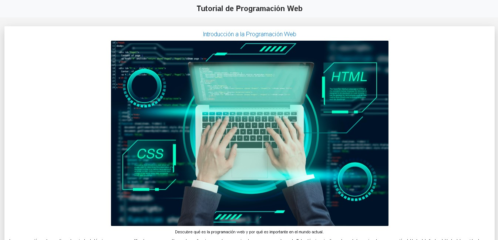

# Tutorial de Programación Web

Este es un proyecto de tutorial de programación web desarrollado con HTML, CSS y JavaScript. Proporciona información básica sobre conceptos fundamentales de la programación web, incluyendo HTML, CSS y JavaScript.

### Temas Cubiertos

- Presencia en línea
- Accesibilidad
- Interactividad y Experiencia de Usuario
- Innovación y Creatividad
- Economía Digital
- Desarrollo Profesional

## Tecnologías Utilizadas
  

<h3>link Deploy</h3>
https://tutorial-programacion-web.netlify.app/

## Créditos
## Designed by Milliany Tech ®2024
Yuliet Faizuli Pachon Caro - 
Nestor Fabian Gutierrez Sabogal - 
Jorge Miller Gutierrez Ospina
